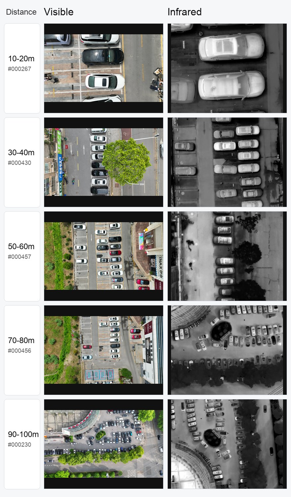

# MSDrone Dataset

MSDrone is a drone-view vehicle detection dataset prepared for research on dual-modal visible-infrared perception and adversarial robustness.

This dataset is associated with the paper **CDUPatch: Color-Driven Universal Adversarial Patch Attack for Dual-Modal Visible-Infrared Detectors**, where MSDrone is used to study object detection and adversarial patch attacks under cross-modal visible/infrared settings, distance changes, and scale variation.



Related paper:

- arXiv: https://arxiv.org/abs/2504.10888
- ACM Digital Library: https://dl.acm.org/doi/10.1145/3746027.3755188

## Project Introduction

MSDrone focuses on vehicle targets captured from drone viewpoints. Compared with ordinary ground-view detection datasets, drone imagery introduces stronger scale changes, viewpoint changes, background clutter, and distance-dependent object appearance. These properties make MSDrone useful for evaluating both detector performance and the robustness of visible-infrared detection systems.

In the CDUPatch study, the dataset supports experiments around color-driven universal adversarial patches for dual-modal detectors. The broader goal is to test whether a physical or image-space patch optimized in the visible domain can remain effective when the scene is represented across visible and infrared modalities.

## Dataset Contents

The current release archive contains:

- 6,167 `.jpg` images
- 6,167 YOLO-format `.txt` labels
- 12,334 data files in total
- Visible-light files marked with `_vis_` and infrared files marked with `_inf_`
- Distance-binned subsets from `0-10m` to `90-100m`
- `image/` and `label/` folders under each distance bin

Distance-bin file counts:

| Distance | Images | Labels |
| --- | ---: | ---: |
| `0-10m` | 110 | 110 |
| `10-20m` | 555 | 555 |
| `20-30m` | 554 | 554 |
| `30-40m` | 743 | 743 |
| `40-50m` | 850 | 850 |
| `50-60m` | 751 | 751 |
| `60-70m` | 769 | 769 |
| `70-80m` | 673 | 673 |
| `80-90m` | 628 | 628 |
| `90-100m` | 534 | 534 |

## Download

The dataset is distributed as GitHub Release assets because the archive is larger than GitHub's normal git file limit.

Download all assets from the latest release:

https://github.com/Jiahuan-Long/MSDrone-dataset/releases/tag/v1.0.0

- `MSDrone.zip.part-aa`
- `MSDrone.zip.part-ab`
- `checksums-sha256.txt`

Reassemble the archive:

```bash
cat MSDrone.zip.part-* > MSDrone.zip
shasum -a 256 MSDrone.zip
```

Compare the output with `checksums-sha256.txt`.

You can also use the helper script:

```bash
bash scripts/assemble_dataset.sh
```

## Label Format

Labels are stored in YOLO text format:

```text
class_id x_center y_center width height
```

Coordinates are normalized to image width and height.

## Citation

If you use MSDrone in work related to CDUPatch, please cite the associated paper:

```bibtex
@article{long2025cdupatch,
  title = {CDUPatch: Color-Driven Universal Adversarial Patch Attack for Dual-Modal Visible-Infrared Detectors},
  author = {Long, Jiahuan and Wu, Zirui and Chen, Zhaoyu and Liang, Junwei and Xue, Feng},
  journal = {arXiv preprint arXiv:2504.10888},
  year = {2025}
}
```

## License

No standalone dataset license file has been provided yet. Please add or confirm the dataset license before public redistribution.
